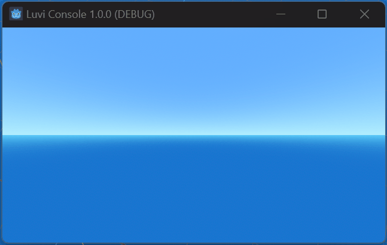

# LuviConsole

LuviConsole is a simple GUI in-game commands console for Godot 4.



## Features

- Easy-to-use console for executing in-game commands
- Supports command history
- Lightweight and efficient

## Installation

1. Download the latest release of LuviConsole from the [GitHub repository](https://github.com/luvikung/GodotLuviConsole/releases).
2. Extract the contents of the downloaded ZIP file.
3. Copy the `LuviConsole` directory into your Godot project's `addons` directory.
4. Enable the LuviConsole plugin in your Godot project settings.

## Usage

1. Add the `LuviConsole` node to your scene.
2. Customize the functionality of the console using the provided properties.
3. Press the designated key (e.g., `F1`) to open the console in-game.
4. Type commands and press `Enter` to execute them.
5. Use the arrow keys (up and down) to navigate through command history.
6. Enjoy the convenience of an in-game console for debugging and testing!

### Custom Commands

1. Create any class that you want to use and then make it to node class.
2. In the class, reference the `LuviConsole` class as variable.
3. in the `_ready()` function, bind the signal of `on_command_execute` to receive the command arguments.
4. In the binded function, create the string receiver statement.

Example of the code (from gif).

```gdscript
extends Node

@export var console: LuviConsole;

func _init() -> void:
	set_process(false)

func _ready():
	if console == null:
		return
	console.on_command_execute.connect(_on_command_executed)

func _on_command_executed(args: Array[String]) -> void:
	if args.size() == 0:
		return
	if args[0] == "clear":
		console.clear()
		return
	if args[0] == "exit":
		get_tree().quit()
		return
	if args[0] == "echo":
		for _index in range(0, args.size(), 1):
			console.print("args[" + str(_index) + "]:" + args[_index])
		return
	if args[0] == "help":
		console.print("Commands:")
		console.print("  clear - Clear the console")
		console.print("  exit - Quit the game")
		console.print("  echo - Print the arguments")
		return
	console.print("Unknown args: " + args[0])
```

## Contributing

Contributions are welcome! If you have any ideas, suggestions, or bug reports, please open an issue or submit a pull request on the [GitHub repository](https://github.com/luvikung/GodotLuviConsole).

## License

This project is licensed under the [MIT License](LICENSE).

## Credits

LuviConsole was created by [Thanut Panichyotai (@LuviKunG)](https://github.com/luvikung).

Special thanks to the Godot community for their support and feedback.
